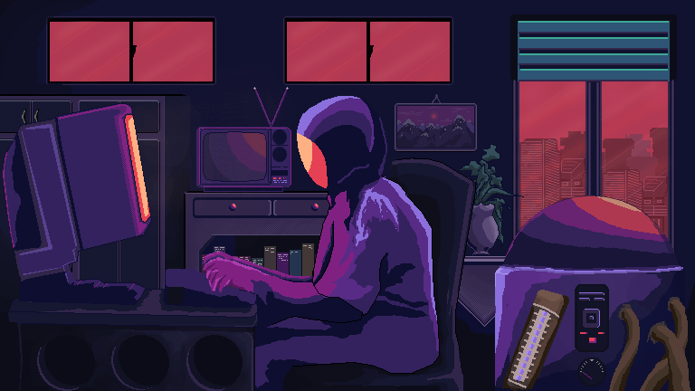

- ✨ **Visitors Counter :** 

<h1 align="center">Hello</h1>

## 👨🏻‍💻 About Me:

- 🙋‍♂️ All about me is at **[My Website](https://google.com/)**

- 🌱 I’m currently learning `Unity (c# & c++)`

- 🤔 I’m looking for help with `Competitive Programming`

- 💬 Ask me about anything :sweat_smile:

- ⚡ I waste most of my time for work in front of computer

- 😎 I like the genre of `pop` music, as well as `Hip hop`

## 🛠️ Technologies and Tools I use:

## Let's get connected:

   

## 📊 My GitHub Data:

  
  
  
  
